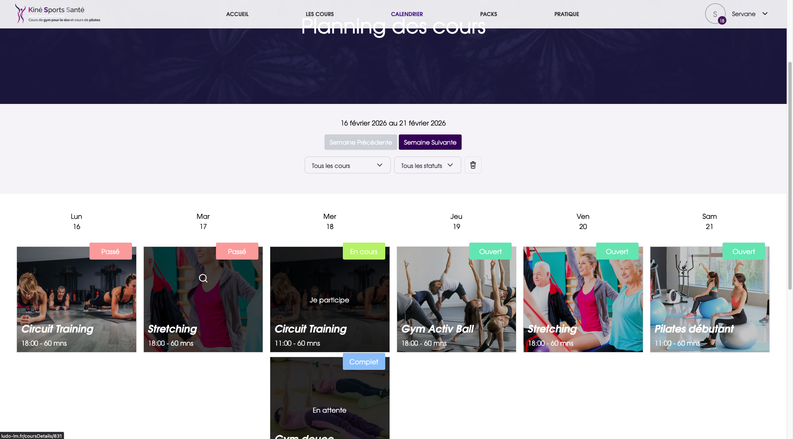
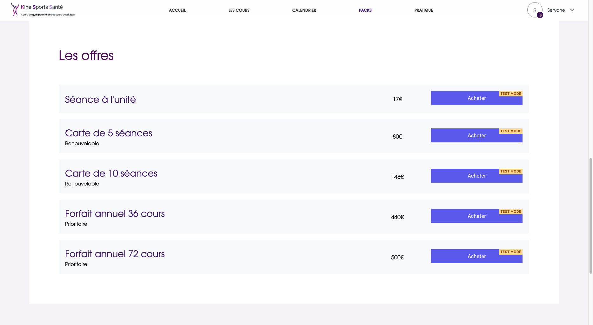
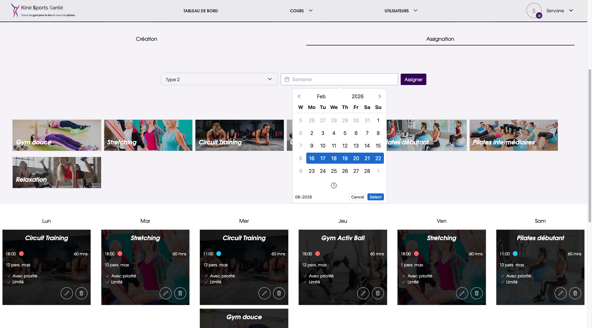
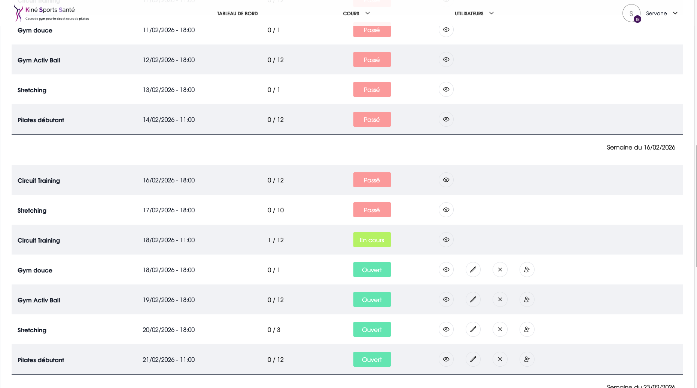

# KSS – Plateforme de Réservation de Cours de Bien-être

Application web complète de réservation et de paiement en ligne pour un centre proposant des cours de Pilates, stretching et gym douce. Projet en production, développé en solo de l'architecture à la mise en ligne.

---

## Aperçu

| Espace utilisateur | Espace admin |
|---|---|
| Inscription / désinscription aux cours | Gestion des cours et des horaires |
| Paiement sécurisé via Stripe | Gestion des utilisateurs et des inscriptions |
| Liste d'attente avec notification email | Tableau de bord et statistiques |
| Historique des paiements (PDF) | Gestion des types de cours |

---

## Screenshots

<p>
  
  
</p>
<p>
  
  
</p>
<p>
  
  
</p>

---

## Stack Technique

**Backend**
- PHP 8.4 / Symfony 7.3
- Doctrine ORM
- JWT Authentication
- Symfony Messenger (traitement asynchrone des emails)
- Redis
- PHPStan + PHP-CS-Fixer (qualité de code)

**Frontend**
- Vue 3 (Composition API) + Vuetify 3
- TypeScript (migration en cours)
- Pinia (state management)
- Tailwind CSS / ApexCharts

**Infrastructure**
- MySQL / Docker
- GitHub Actions — CI/CD complet (tests, analyse statique, lint)

**Services tiers**
- Stripe (paiements en ligne)
- Mailjet (notifications email transactionnelles)
- Sentry (monitoring d'erreurs)

---

## Architecture

Le projet suit une architecture orientée services avec séparation claire des responsabilités :

```
src/
├── Controller/       # 13 controllers REST fins, délèguent aux services
├── Service/          # 33 services métier (réservation, paiement, liste d'attente...)
├── Entity/           # 11 entités Doctrine
├── DTO/              # Objets de transfert de données
├── MessageHandler/   # Handlers Messenger pour le traitement async
└── EventSubscriber/  # Abonnés aux événements Symfony
```

---

## Fonctionnalités clés

- **Réservation en temps réel** avec gestion des places disponibles
- **Liste d'attente automatique** — notification email dès qu'une place se libère (traitement async via Messenger + Redis)
- **Paiement Stripe** avec historique téléchargeable
- **Authentification JWT** avec rôles utilisateur / administrateur
- **CI/CD GitHub Actions** — pipeline complet à chaque push

---

## Tests & Qualité

```bash
make test      # Tests PHPUnit
make phpstan   # Analyse statique PHPStan
make cs        # Formatage PHP-CS-Fixer
make rector    # Refactoring automatique Rector
make analyse   # Lance cs + rector + phpstan + test en une commande
```

---

## Auteur

Développé en solo — architecture, développement, intégration des services tiers et mise en production.
